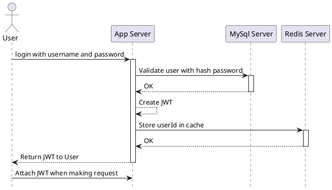
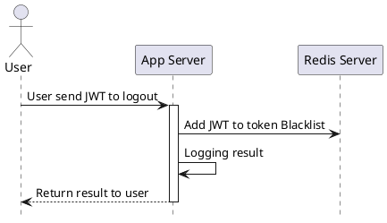
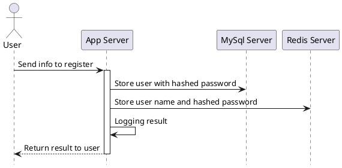
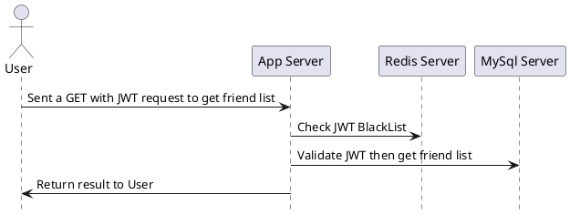
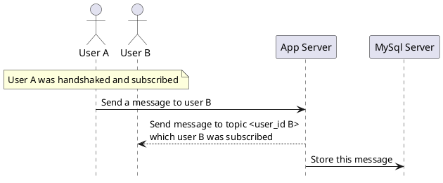
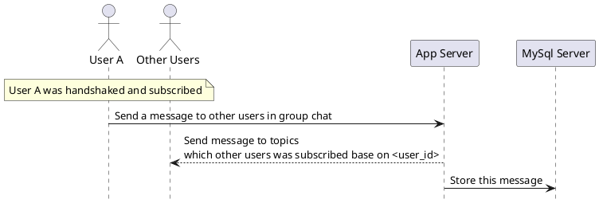
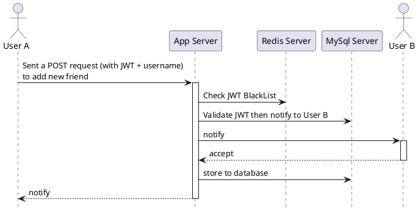
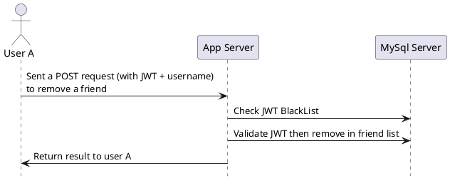
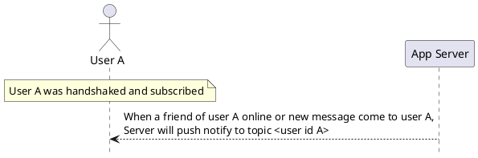
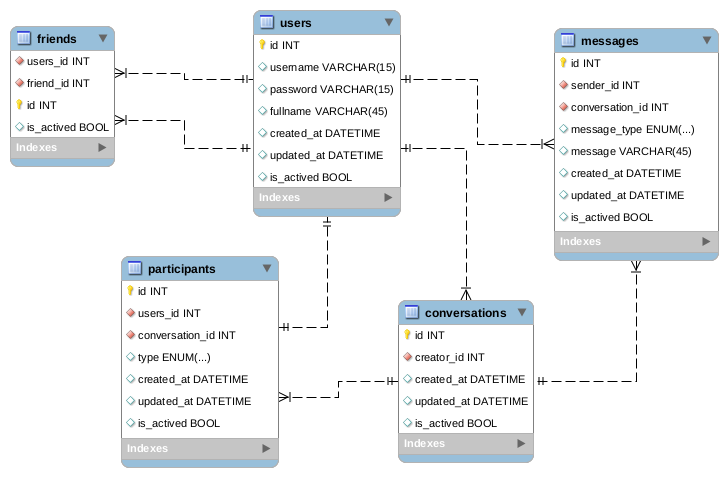

# Foo-App

- [Foo-App](#foo-app)
  - [Overview](#overview)
  - [Architecture model](#architecture-model)
  - [Features](#features)
  - [How to run](#how-to-run)
  - [Demo](#demo)
  - [Technical stack](#technical-stack)
  - [Sequence diagrams for API](#sequence-diagrams-for-api)
    - [1. Login](#1-login)
    - [2. Logout](#2-logout)
    - [3. Register](#3-register)
    - [4. View list users/friend](#4-view-list-usersfriend)
    - [5. Chat 1-1](#5-chat-1-1)
    - [6. Chat group](#6-chat-group)
    - [7. Add friends](#7-add-friends)
    - [8. Remove friends](#8-remove-friends)
    - [9. Notification](#9-notification)
  - [Database Diagram](#database-diagram)

## Overview

## Architecture model

## Features

## How to run

## Demo

## Technical stack

## Sequence diagrams for API

### 1. Login

### 2. Logout

### 3. Register

### 4. View list users/friend

### 5. Chat 1-1

### 6. Chat group

### 7. Add friends

### 8. Remove friends

### 9. Notification

## Database Diagram

