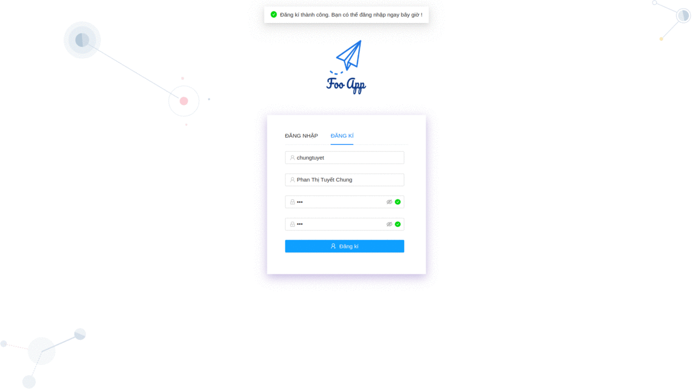

# Foo App

---------------

- [Foo App](#foo-app)
  - [1. Tổng quan](#1-tổng-quan)
  - [2. Hướng dẫn chạy](#2-hướng-dẫn-chạy)
  - [3. Demo](#3-demo)
  - [4. Document](#4-document)
  - [4. References](#4-references)

## 1. Tổng quan

**Foo App** là một training project  thuộc chương trình  ZaloPay Fresher 2020 sử dụng React JS, Vert.x để xây dụng một ứng dựng chat real-time đơn giản bao gồm các chức năng cơ bản:

  - Đăng nhâp / Đăng xuất (có sử dụng JWT)
  - Đăng kí tài khoản
  - Xem danh sách tất cả bạn bè trong hệ thống
  - Chat 1 - 1
  - Kết bạn
  
  Ngoài ra ứng dụng còn có một số chức năng mô phỏng một ví điện tử như: 
- Chuyển tiền cho một người trong danh sách user
- Xem số dư hiện tại
- Xem lịch sử giao dịch


Các công nghệ sử dụng:

- `React`, `Redux` cho phía client.
- `Ant.design` cho thiết kế UI
- `Java Vert.x` cho việc xây dựng API cho server.
- `WebSocket` cho việc gửi/nhận tin nhắn real time.
- `MySQL` làm database chính và `Redis` cho caching data.
- `gRPC` cho việc xây dựng các chức năng fintech.

## 2. Hướng dẫn chạy

- Mọi quá trình để build và thực thi project đã được viết trong file docker-compose.yml. Tại thư mục gốc của repo, chạy lệnh :

```bash
docker-compose up --build
```

- Quá trình chạy lần đầu có thể sẽ tốn nhiều thời gian cho việc build service backend.

- Ứng dụng client sẽ chạy trên port `3006`. Test trên trình duyệt tại `localhost:3006`.

## 3. Demo



## 4. Document

https://github.com/NoRaDoMi/foo-app/wiki

## 5. Authors

- PhucVT - Zaloapy Fresher

## 6.Acknowledgments

- AnhLD2 - Principal Software Engineer at VNG
- ThieuVT
- ToanDA
