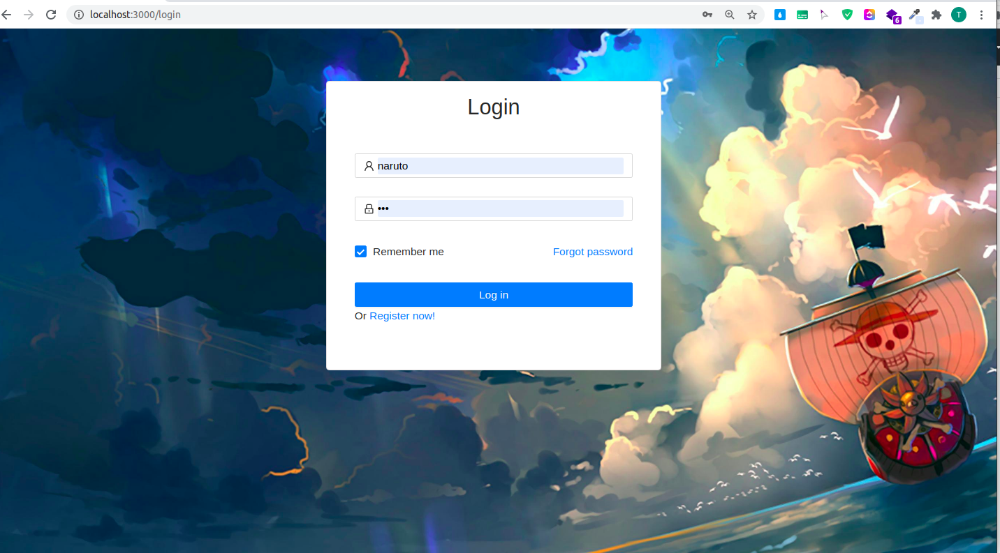
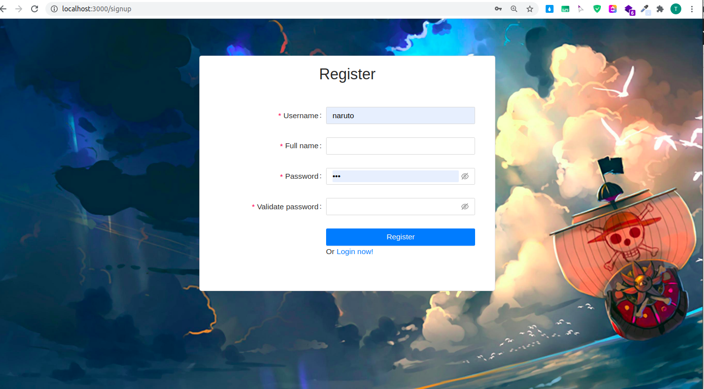
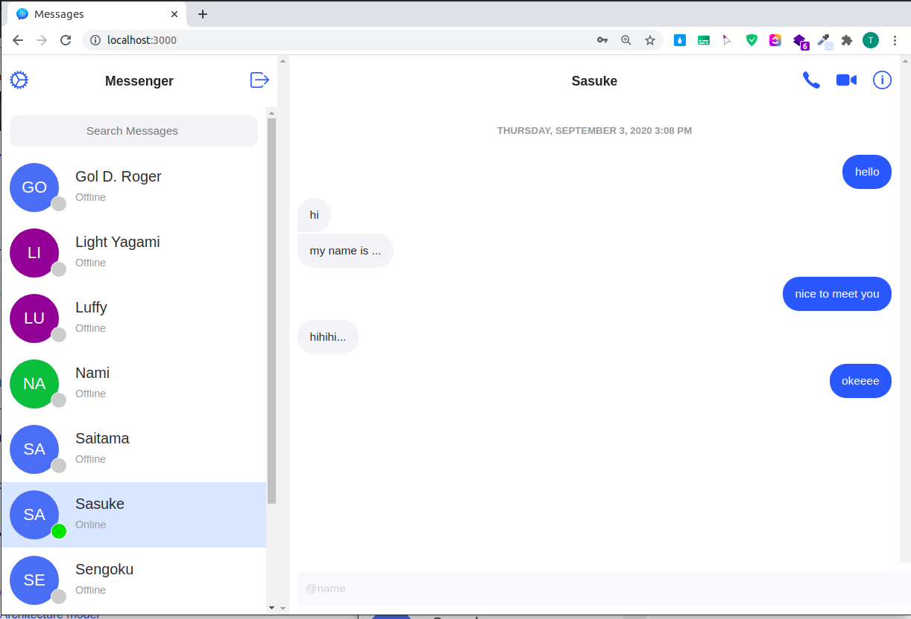
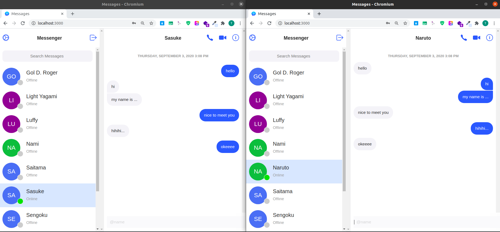

# Foo App

---------------

- [Foo App](#foo-app)
  - [1. Tổng quan](#1-tổng-quan)
  - [2. Hướng dẫn chạy](#2-hướng-dẫn-chạy)
    - [2.1 MySQL và Redis](#21-mysql-và-redis)
    - [2.2 Back-end](#22-back-end)
    - [2.3 Front-end](#23-front-end)
  - [3. Demo](#3-demo)
    - [3.1 Đăng nhập](#31-đăng-nhập)
    - [3.2 Đăng kí](#32-đăng-kí)
    - [3.1 Xem danh sách user](#31-xem-danh-sách-user)
    - [3.4 Chat 1 - 1](#34-chat-1---1)
  - [4. References](#4-references)

## 1. Tổng quan

**Foo App** là một training project  thuộc chương trình  ZaloPay Fresher 2020 sử dụng React JS, Vert.x để xây dụng một ứng dựng chat real-time đơn giản bao gồm các chức năng cơ bản:

- Đăng nhâp / Đăng xuất (có sử dụng JWT)
- Đăng kí tài khoản
- Xem danh sách tất cả người dùng của hệ thống
- Chat 1 - 1

Các công nghệ sử dụng:

- `React`, `Redux` cho phía client.
- `Java Vert.x` cho việc xây dựng API cho server.
- `WebSocket` cho việc gửi/nhận tin nhắn real time.
- `MySQL` làm database chính và `Redis` cho cache.

## 2. Hướng dẫn chạy

### 2.1 MySQL và Redis

- Trong thư mục `foo-setup`, chạy các lệnh để chạy MySql server và Redis server và khởi tạo dữ liệu:

```bash
docker-comple up -d
```

### 2.2 Back-end

- Trong thư mục `foo-backend`:

- **Build**: chạy lệnh sau:

```bash
mvn clean install
```

- **Run**: chạy lệnh sau:

```bash
java -Dservice.conf=./conf/development.yaml -Dlog4j2.configurationFile=./conf/log4j2.xml -Dredis.conf=./conf/redis.yaml -cp target/foo-backend-1.0-SNAPSHOT.jar vn.zalopay.phucvt.fooapp.Runner
```

### 2.3 Front-end

- Trong thư mục foo-frontend, chạy các lệnh sau:

```bash
npm insatll --silent // cài đặt các dependencies
npm start
```

Ứng dụng client sẽ chạy trên port `3000`. Test trên trình duyệt tại `localhost:3000`.

## 3. Demo

### 3.1 Đăng nhập



### 3.2 Đăng kí



### 3.1 Xem danh sách user



### 3.4 Chat 1 - 1



## 4. References

- [Sequence diagrams](docs/sequence-diagrams.md)

- [Database model](docs/database-model.md)

- [Redis cache specifications](docs/cache-specifications.md)

- [API Specifications](https://app.swaggerhub.com/apis/NoRaDoMi/Foo_Chat_Application/1.0.0)

- [Web-socket specifications](docs/websocket-specification.md)