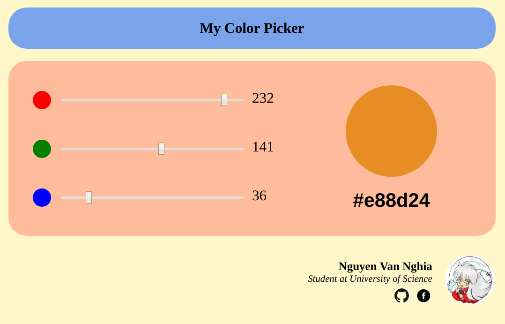

# Basic knowledge of Web development

- [Basic knowledge of Web development](#basic-knowledge-of-web-development)
  - [1. Mục tiêu](#1-mục-tiêu)
  - [2. Nội dung](#2-nội-dung)
    - [2.1.Frontend Basic](#21frontend-basic)
    - [2.2. JavaScript](#22-javascript)
  - [3. Bài tập nhỏ](#3-bài-tập-nhỏ)
    - [3.1. Phương thức đánh giá](#31-phương-thức-đánh-giá)
    - [3.2. Đề bài (Color Chooser)](#32-đề-bài-color-chooser)
  - [Tham khảo](#tham-khảo)
  
## 1. Mục tiêu

- Cung cấp khái niệm cơ bản về Web Development:html, css, javascript
- Fresher tìm hiểu lý thuyết theo các keyword cung cấp, viết lại báo cáo dạng markdown.

## 2. Nội dung

### 2.1.Frontend Basic

- **HTML5**
- **CSS3**
- **Responsive Web Design**
- **Màu sắc trong thiết kế Web**?
- Tham khảo một số CSS Framework: **Bootstrap**, **Semantic UI**, ...

### 2.2. JavaScript

- **JavaScript Syntax**
- Async trong JavaScript: **Callback**, **Promise**, **Async/Await**, **Callback hell**
- **Closure**
- OOP trong JavaScript: **Prototype**, **Class**
- Một số thư viện JavaScript: **lodash**, **moment**, ...

## 3. Bài tập nhỏ

### 3.1. Phương thức đánh giá

- Review code.
- Hỏi đáp code để đánh giá độ thấu hiểu vấn đề.

### 3.2. Đề bài (Color Chooser)

*Mô tả*: Xây dựng một ứng dụng Web đơn giản cho phép người dùng chọn các chỉ số RGB để lấy mã màu.

*Tính năng gồm có*:

- Các thanh trượt cho phép người dùng chọn các giá trị màu RGB.
- Khung thể hiện màu tổng hợp được chọn và mã màu của nó.
- Xem thông tin tác giả viết ứng dụng.

Tỉ lệ kiến thức cần để thực hiện: HTML (20%), CSS (60%), JavaScript (20%).

*Các bước làm*:

- Nhìn ứng dụng mẫu, suy nghĩ hướng bố trí thẻ, phân vùng sao cho dễ dàng layout nhất.
- Suy nghĩ cách lấy giá trị màu, hiển thị màu, thuật toán tìm màu.
- Dựng trang HTML theo hướng bố trí đã suy nghĩ.
- Dựng CSS để hoàn thiện giao diện.
- Xử lý JavaScript theo thuật toán đã suy nghĩ.
- Hiệu chỉnh lại giao diện, bố trí.

*Tham khảo*:

## Tham khảo

- [The Ultimate VSCode Setup for Front End/JS/React](https://medium.com/productivity-freak/the-ultimate-vscode-setup-for-js-react-6a4f7bd51a2)
- [Tutorial for HTML, CSS, JavaScript](https://www.w3schools.com/)
