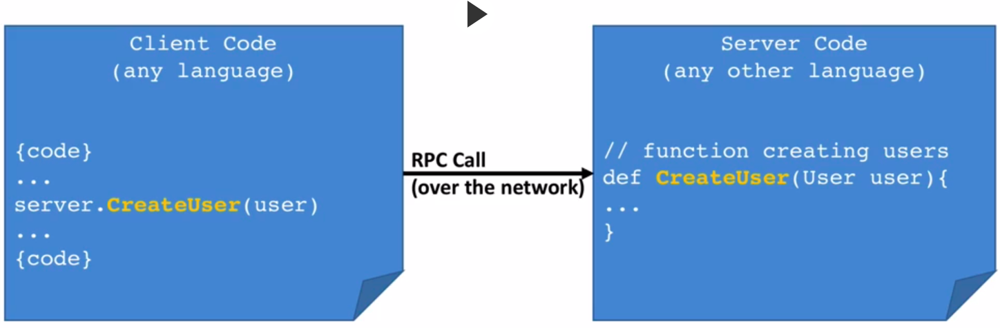
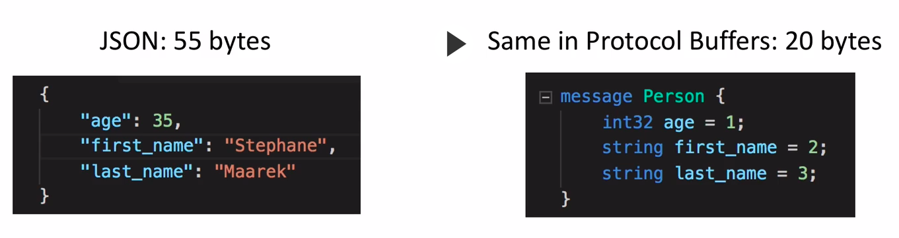
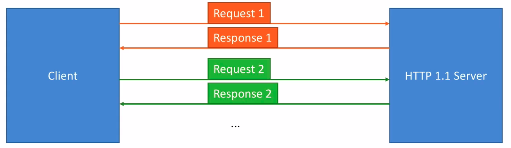
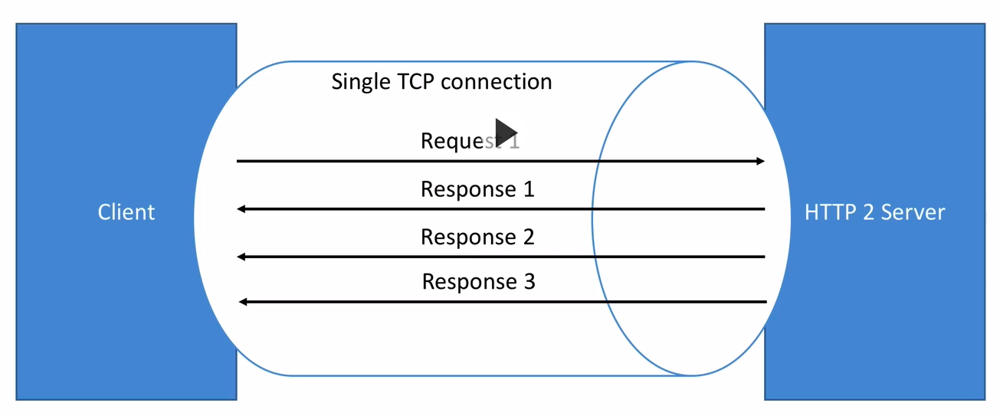
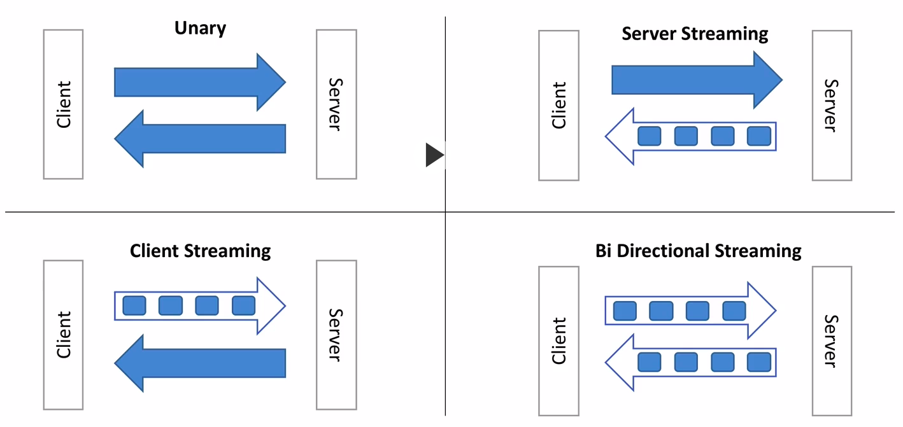
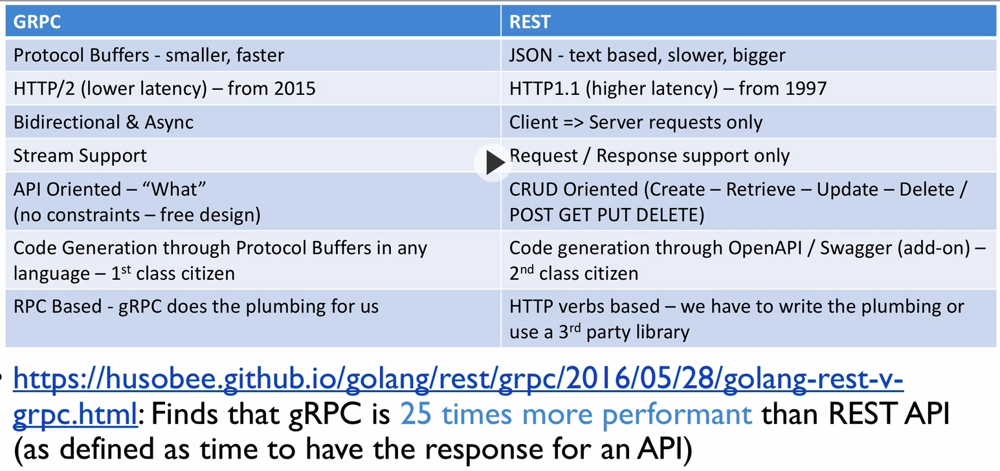

# gRPC

- [gRPC](#grpc)
  - [1. Mục tiêu](#1-mục-tiêu)
  - [2. Nội dung](#2-nội-dung)
  - [Tham khảo](#tham-khảo)

## 1. Mục tiêu

- Mục tiêu phần này là cung cấp khái niệm cơ bản về grpc các sử dụng grpc cơ bản
- Fresher tìm hiểu lý thuyết theo các keyword cung cấp, viết lại báo cáo dạng markdown.

## 2. Nội dung

- gRPC: pros and cons,  how to use...
- protocol buffers
  
## Tham khảo

- [gRPC in java](https://grpc.io/docs/languages/java/quickstart/)
- [Protocol buffer](https://developers.google.com/protocol-buffers/docs/overview)
- [gRPC web](https://github.com/grpc/grpc-web)

## Research

## What's is gRPC

- A free and open-source framework developed by Google.
- Part of Cloud Native Computation Foundation (CNCF) - like Docker & Kubernetes for example.
- At a high level, it allows you to define REQUEST & RESPONSE for RPC (Remote Procedure Calls) and handles all the rest for you.
- On top of it, it's `modern`,`fast and efficent`, build on top of `HTTP/2`, `low latency`, support `streaming, language independent`, and make it super easy to plug in `authentication`, `load balancing`, `logging`, and `monitoring`.

## What's an RPC

- A `Remote Procedure Call`.
- In your CLIENT code, it look like you're just calling a function direcly on the SERVER.
- It's not a new concept (CORBA (Common Object Request Broker Arch) had this before)
- With gRPC, it's implemented very clennly and solves a lot of problems that others frameworks have.

## How to get started

- Define messages and services using Protocol Buffers -> .proto files
- The rest of the gRPC code will be generated for you
- You'll to provide an implementation for it.
- 1 .proto file works for over 12 programming languages -> scales to milions of RPC/second

## Why Protocol Buffers

- Are langugage agnostic
- Code can be generated for pretty much any language
- Data is binary and effciently serialized (small payloads)
- Very convenient for transportinga lot of data.

## Protocol Buffers basic (later)

### Protocol Buffers role in gRPC

- Used to define:
  - Messages (data for Request and Response)
  - Service (Service name and RPC endpoints): service where define API endpoint

- gRPC = PB + generated code for you

- Efficency of PB over JSON:
  
  - gRPC uses PB for communications
  - PB save Network bandwidth.
  - Parsing JSON is actually CPU intensive (chuyên sâu) (because the format is human readable)
  - Parsing Protocol Buffers (`binary` format) is less CPU intensive because it's closer to how a machine represents data
- Using grpc, the use of PB means `faster` and more `efficent` communication, friendly with mobile devices that have a slower CPU

Why gRPC works across languages and platforms ? => Because it use Protocol Buffers for communications that code can be ganerated for pretty much any language.

## gRPC Languages

- gRPC will have these main implementations:
  - GRPC-JAVA: pure implementations of gRPC in Java
  - GRPC-GO: ... in Go
  - GRPC-C: ... in C, include
    - gRPC C++, Python, ...
- gRPC can be used by any language
  - Because the code can be generated for any language, it make it super simple to create micro-services in any language that interact with each other.
  - Any language can iteract with any language using common framework.

- Why Protocol Buffers + gRPC:
  - Easy to write message definition
  - The definition of the API is independent from implementation: .proto files using common that using Protocol Buffers rules.
  - A huge amount of code can be generated, in any language, from a simple .proto file.
  - The payload of Protocol Buffers  is binary, therrefore very efficient to send/receive on a network and serializing/de-serializing on a CPU ,will use less lifecycle of CPU. 
  - Protocol Buffers defines rules to make an API evolve without breaking existing clients, which is helpful for microservices.

## What's HTTP/2

- **gRPC leverages HTTP/2 and only HTTP/2 as a backbone for communications**

[Demo: http2-vs-http1](https://imagekit.io/demo/http2-vs-http1)

### How HTTP/1.1 works

- HTTP 1.1 was released in 1997
- HTTP 1.1 opens a new TCP connection to a server at each request (if ignore `Keep-Alive` header)
- It does not compress headers (which are plaintext)
- It only works with Request/Response mechanism (no server push)
- Disadvantages:
  - Nowadays, a web page loads 80 assets on average
  - Headers are sent at every request and are PLAINTEXT (heavy size) and any time, it may be have same headers -> use much bandwith
  - Each request opens a TCP connection
  - These inefficiencies add latency and increase network packet size

### How HTTP/2 works

- HTTP 2 was released in 2015. It has been battled tested for many years (and was before that tested by Google under the name SPDY)
- Advantages:
  - HTTP 2 supports multiplexing
    - The client & server can push messages in parallel over the same TCP connection
    - This reduces latency
  - HTTP 2 supports server push
    - Servers can push streams (chuỗi - multiple mesages) for one request from the client
    - This saves round trips (lantency)
  - HTTP 2 supports header compression
    - Headers (text based) can now be compressed
    - These have much less impact on the packet size
    - (remember the average http request may have over 20 headers, due to cookies, content cache, and application headers)
  - HTTP 2 is binary
    - While HTTP 1 text makes it easy for debugging, it's not efficient over the network
    - (Protocol buffers is a binary protocol and makes it great match for HTTP 2)
  - HTTP 2 is secure (SSL is not required but recommended by default)

- HTTP 2: Bottom line
  - Less chatter (client-serer)
  - More efficient protocol (less bandwidth)
  - Reduced lantency
  - Incresed Security

## 3. 4 Types of gRPC APIs

- Unary: tranditional API look like (HTTP Rest): 1 request -> 1 response
  - The client will send `one` message to the server and will receive `one` response from the server.
  - Unary RPC calls will be the most common for your APIs.
    - Unary calls are very well suited when **your data is small**
    - Start with Unary when writing APIs and use streaming API if performance is an issue.
- Server Streaming: server return a stream of responses
  - Server Streaming RPC API are a `NEW` kind API enabled thanks to `HTTP/2`
  - The client will send `one` message to server and will receive `many` - streams of responses from server, possibly an infinite number
  - Streaming Server are well suited for
    - when the server needs to send a lot of data (big data)
    - When the server needs to **"PUSH"**  data to the client without having the client request for more (think live feed, chat, etc)
  - In gRPC Server Streaming Calls are define using the keyword `"stream"`
- Client Streaming: client send a stream of requests
- Bi Directional Streaming

## Scalability in gRPC

- gRPC Servers are asynchronous by default
- This means they do not block threads on request
- Therefore each gRPC server can serve millions of requests in parallel

 

- gRPC Clients can be asynchronous or synchronous (blocking)
- The client decides which model works best for the performance needs
- gRPC Clients can perform client side load balancing ???

> Google has 10 BILLION gRPC requests being made per second internally.

## Security in gRPC

- Be default gRPC strongly advocates for you to use SSL (encryption over the wire) in your API
- This means that gRPC has security as a first class citizen
- Each language will provide an API to load gRPC with the required certificates and provide encryption capability out of the box
Addtionally using Interceptors, we can also provide authentication

## Rest API vs gRPC

## Summary: Why use gRPC

- Easy code definition in over 11 languages
- Use a modern, low latency HTTP/2 transport mechanism
- SSL Security is build in
- Support for streaming APIs for maximum performence
- gRPC is API oriented, instead of Resource Oriented like REST

## High-level Components: 3 layers

### Stub

### Channel

### Transport

- 3 Transport implementations:
  - Netty-based transport: main transport based on Netty, applied for both client and server.
  - OkHttp-based transport: lightweight transport based on OkHttp, mainly for use on Android and is for client only.
  - In-process tranport when server vs client in same process, useful for testing...