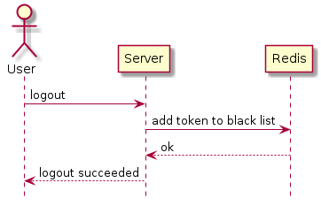
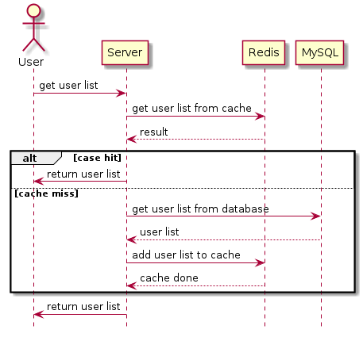
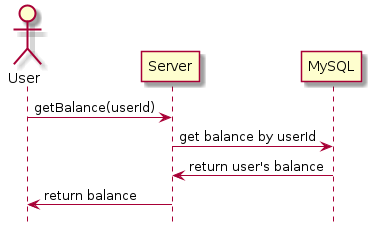
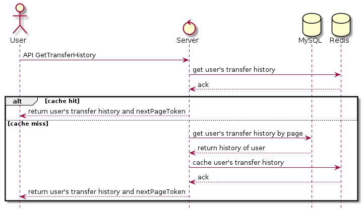
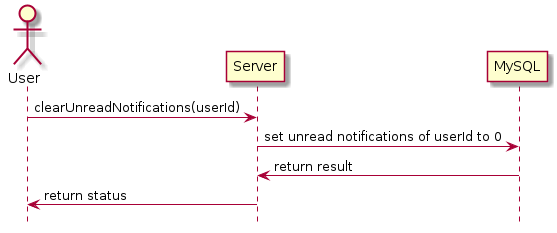

# Sequence Diagrams & Database Model

- [Sequence Diagrams & Database Model](#sequence-diagrams--database-model)
  - [1. Sequence Diagrams](#1-sequence-diagrams)
    - [1.1 Sign in](#11-sign-in)
    - [1.2. Log out](#12-log-out)
    - [1.3. Sign up](#13-sign-up)
    - [1.4. View list users](#14-view-list-users)
    - [1.5. Chat single](#15-chat-single)
    - [1.6. View balance](#16-view-balance)
    - [1.7. Transfer money](#17-transfer-money)
    - [1.8. View history](#18-view-history)
    - [1.9. View notifications](#19-view-notifications)
    - [1.10. Clear unread notifications](#110-clear-unread-notifications)
    - [1.11. Remind transfer money](#111-remind-transfer-money)
  - [2. Database Model](#2-database-model)

## 1. Sequence Diagrams

### 1.1 Sign in

### 1.2. Log out

### 1.3. Sign up

### 1.4. View list users

### 1.5. Chat single

### 1.6. View balance

### 1.7. Transfer money

### 1.8. View history

### 1.9. View notifications

### 1.10. Clear unread notifications

### 1.11. Remind transfer money

## 2. Database Model

